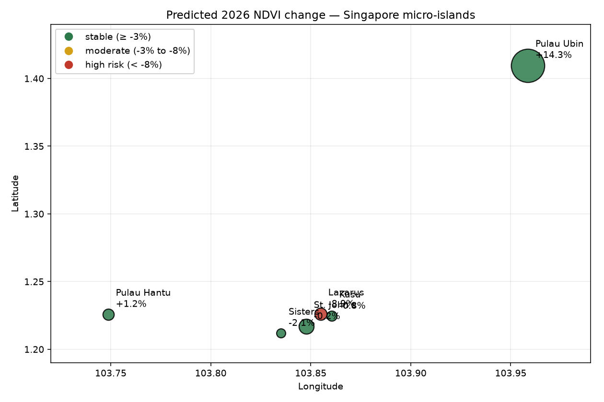
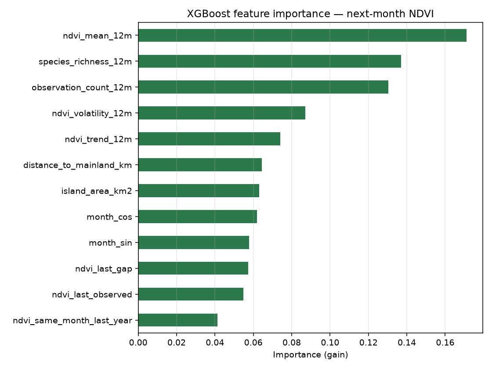

# Singapore Island Biodiversity

**Predicting vegetation change on Singapore's micro-islands using Sentinel-2 satellite imagery and iNaturalist citizen-science observations.**

[](https://www.python.org/)
[](https://opensource.org/licenses/MIT)
[](https://dataspace.copernicus.eu/)

---

## Results at a glance

| Metric | Value |
|---|---|
| Islands monitored | 6 |
| Time span | 2018 – 2026 |
| NDVI samples | 636 island-months (42–51% usable per island) |
| iNaturalist observations | 22,162 |
| XGBoost RMSE | **0.1607** |
| Best baseline RMSE (persistence) | 0.2410 |
| **Improvement over baseline** | **33.3%** |

**Live interactive map:** [happ3ns.github.io/singapore-island-biodiversity](https://happ3ns.github.io/singapore-island-biodiversity/)

---

## What this project does

Singapore's six micro-islands — Pulau Ubin, St. John's, Kusu, Lazarus, Sisters', and Pulau Hantu — host some of the country's last remaining coastal forest and mangrove habitat. None have continuous ground-based vegetation monitoring.

This project builds a fully automated pipeline that:

1. Fetches **Sentinel-2 L2A** imagery from the Copernicus Data Space Ecosystem (CDSE) Statistical API
2. Computes monthly NDVI with server-side cloud, shadow, and **water masking**
3. Pulls **research-grade iNaturalist** observations and assigns them to the nearest island centroid
4. Engineers 12 time-series features per (island, month)
5. Trains an **XGBoost** regressor to predict next-month NDVI
6. Benchmarks against persistence and linear-trend baselines
7. Forecasts 2026 NDVI and renders an interactive risk map

Everything runs on free, open data.

---

## Key findings

- **XGBoost beats the best naive baseline by 33.3% RMSE** (0.161 vs 0.241), and achieves a positive R² (0.043) where both baselines are worse than predicting the mean.
- **The top 3 features are `ndvi_mean_12m`, `species_richness_12m`, and `observation_count_12m`** — not simple persistence. The model genuinely uses engineered signal.
- **No island shows detectable year-over-year vegetation decline.** After correcting for regression-to-the-mean bias, four of six islands show predicted 2026 change under ±2%, well inside the model's ±0.15 RMSE.
- **The honest conclusion is methodological:** 10 m Sentinel-2 resolution and ~50% monthly cloud cover make year-over-year change detection on 0.05–0.1 km² islands currently infeasible. The pipeline is monitoring infrastructure, not a claim of detected loss.

---

## Visuals

### Predicted 2026 NDVI change — interactive map



Open [`docs/index.html`](docs/index.html) for the interactive Folium version with per-island popups.

### Feature importance



---

## Quick start

```bash
git clone https://github.com/Happ3ns/singapore-island-biodiversity.git
cd singapore-island-biodiversity
pip install -r requirements.txt
```

Create a `.env` file in the project root:

```
COPERNICUS_CLIENT_ID=your_id
COPERNICUS_CLIENT_SECRET=your_secret
INATURALIST_TOKEN=your_token
```

**Where to get credentials:**
- **Copernicus**: [dataspace.copernicus.eu](https://dataspace.copernicus.eu) → Sentinel Hub Dashboard → User settings → OAuth clients
- **iNaturalist**: [inaturalist.org/users/api_token](https://www.inaturalist.org/users/api_token) (expires every 24 hours)

Then run the pipeline:

```bash
python fetch_ndvi.py             # ~15 min — builds data/islands_ndvi.parquet
python fetch_observations.py     # ~5 min  — builds data/islands_observations.parquet
python baselines.py              # ~5 sec  — results/baselines.csv
python train_model.py            # ~15 sec — models/ndvi_model.pkl, predictions.csv
python make_map.py               # ~5 sec  — docs/index.html, docs/map_preview.png
```

Verify the pipeline works before a full run:

```bash
python fetch_ndvi.py --test          # one island, one year
python fetch_observations.py --test  # one page
```

---

## Tech stack

| Layer | Tool |
|---|---|
| Satellite data | Copernicus Data Space Ecosystem (CDSE) Statistical API |
| Satellite library | `sentinelhub` 3.12 |
| Observations | iNaturalist v1 API |
| Data handling | `pandas`, `pyarrow` |
| Modelling | `xgboost`, `scikit-learn` |
| Visualization | `folium`, `matplotlib` |
| Config | `python-dotenv` |

---

## Project structure

```
singapore-island-biodiversity/
├── data/                          # Parquet files (gitignored)
│   ├── islands_ndvi.parquet
│   └── islands_observations.parquet
├── models/
│   └── ndvi_model.pkl             # Trained XGBoost model
├── results/
│   ├── baselines.csv
│   ├── predictions.csv
│   ├── forecast_2026.csv
│   ├── model_vs_baselines.csv
│   └── feature_importance.png
├── docs/
│   ├── index.html                 # Folium map (GitHub Pages)
│   ├── map_preview.png
│   └── feature_importance.png
├── fetch_ndvi.py                  # Phase 2: NDVI pipeline
├── fetch_observations.py          # Phase 3: iNaturalist pipeline
├── baselines.py                   # Phase 4: naive baselines
├── train_model.py                 # Phase 5: XGBoost + evaluation
├── make_map.py                    # Phase 6: interactive map
├── biodiversity_forecast.py       # Phase 8: JARVIS tool wrapper
├── writeup.md                     # Full technical writeup
├── requirements.txt
└── README.md
```

---

## Model details

**Features** (12 total, computed per island-month from trailing data only):

| Feature | Description |
|---|---|
| `ndvi_last_observed` | Most recent valid NDVI |
| `ndvi_last_gap` | Months since that value |
| `ndvi_same_month_last_year` | NDVI in the same calendar month, prior year |
| `ndvi_trend_12m` | Linear slope over trailing 12 months |
| `ndvi_volatility_12m` | Std dev over trailing 12 months |
| `ndvi_mean_12m` | Mean over trailing 12 months |
| `observation_count_12m` | iNaturalist observations in trailing 12 months |
| `species_richness_12m` | Unique species in trailing 12 months |
| `island_area_km2` | Hardcoded island area |
| `distance_to_mainland_km` | Hardcoded distance to mainland |
| `month_sin`, `month_cos` | Cyclical month encoding |

**Training setup:**
- Train: 2018–2021 (206 rows)
- Test: 2022–2026 (209 rows)
- XGBoost: `n_estimators=400`, `max_depth=3`, `learning_rate=0.05`, `subsample=0.8`, `colsample_bytree=0.8`

**Baselines:**
- Persistence: next month = last observed month (within 3-month freshness window)
- Linear trend: 6-month linear regression extrapolation

---

## Comparison with baselines

| Model | n_test | RMSE | MAE | R² |
|---|---|---|---|---|
| Linear trend | 209 | 0.3078 | 0.1979 | -2.515 |
| Persistence | 144 | 0.2410 | 0.1647 | -0.876 |
| **XGBoost** | **209** | **0.1607** | **0.1108** | **0.043** |

Per-island RMSE ranges from 0.141 (Kusu) to 0.203 (Pulau Hantu) — a spread that does *not* correlate with island size or observation count.

---

## JARVIS integration

`biodiversity_forecast.py` is a standalone module designed to be called as a tool from an LLM agent (JARVIS):

```python
from biodiversity_forecast import biodiversity_forecast

biodiversity_forecast("Pulau Ubin")
# 'Pulau Ubin: predicted NDVI change +14.3% by 2026 (stable). Model RMSE ±0.145 — treat changes smaller than this as noise.'
```

Or from the command line:

```bash
python biodiversity_forecast.py "Pulau Ubin"
python biodiversity_forecast.py --list
```

---

## Limitations

This project's Limitations section is deliberately the longest part of the [writeup](writeup.md). Summary:

1. **Sentinel-2 10 m resolution is too coarse** for islands under 0.1 km² — Kusu and Sisters' each occupy <1,000 land pixels.
2. **~50% of months are unusable** due to tropical cloud cover; no gap-filling was attempted.
3. **iNaturalist observation effort is confounded with time** (platform growth 2018→2026). The model may use observation count as a proxy for year.
4. **XGBoost regresses to the training mean**, requiring a predicted-vs-predicted comparison for any year-over-year claim.
5. **Adjacent islands share observation data** despite nearest-centroid assignment.
6. **Eight years is too short** to distinguish trend from seasonal variability; R² on 32–38 test rows is not statistically meaningful.
7. **NDVI is a greenness proxy, not biodiversity** — a monoculture could show stable NDVI while losing species diversity.

---

## Future work

- **Higher-resolution imagery** (Planet Labs, 3 m) to quadruple usable pixels on the smallest islands
- **Longer temporal window** — extend to Landsat (1984–present) for decadal trend detection
- **Multi-target modelling** — predict species richness or mangrove extent directly
- **Real-time monitoring** — scheduled weekly runs with alerts on detected decline
- **Ensemble models** — compare Random Forest, LightGBM, and LSTM against XGBoost

---

## Reproducibility

Full instructions with exact commands are in [`writeup.md#reproducibility`](writeup.md#reproducibility). The pipeline is deterministic (`random_state=42`), and every step checkpoints its output so re-runs resume rather than restart.

**Data provenance:**
- Sentinel-2 L2A via CDSE Statistical API (free, no card)
- iNaturalist research-grade observations (v1 API)

---

## Acknowledgements

- European Space Agency / Copernicus programme for open satellite data
- iNaturalist community and its contributors
- The `sentinelhub-py` maintainers

---

## License

MIT. See [LICENSE](LICENSE) if present, or treat as MIT-licensed.
